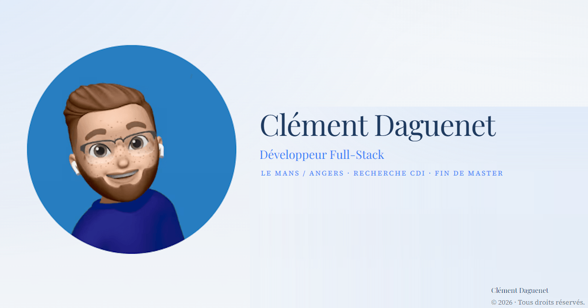

## À propos

Développeur Fullstack passionné par la conception d'applications web et logicielles.

J'aime construire des projets de bout en bout, de l'architecture au déploiement, en passant par le développement frontend, backend et la gestion des données.

Je m'intéresse également au développement logiciel et à la création de projets personnels autour du modding Minecraft.

## Technologies

### Langages

### Frameworks & Web

### Outils & DevOps

## Projets sélectionnés

### Portfolio personnel

Portfolio présentant mon parcours, mes compétences et mes projets.

**Stack :** Next.js, React, TypeScript

[Voir le projet](https://github.com/ClementDaguenet/portfolio-clementdaguenet) · [Voir le portfolio](https://clement-daguenet.fr/)

### Portfolio WoXayZ

Portfolio dédié à mes projets de développement autour de Minecraft et du modding.

**Stack :** Next.js, React, TypeScript

[Voir le projet](https://github.com/ClementDaguenet/portfolio-woxayz)

### ClimSystem Nantes

Site web professionnel développé pour ClimSystem, distributeur en génie climatique sur le Grand Ouest.

Le projet comprend un site vitrine complet ainsi qu'un back-office permettant de gérer les agences, les médias, les contenus et les paramètres du site.

**Stack :** Next.js, TypeScript, React, PostgreSQL, Prisma, Tailwind CSS, Vercel

[Voir le projet](https://github.com/ClementDaguenet/ClimSystemNantes)

## GitHub

## Me contacter

GitHub : https://github.com/ClementDaguenet

LinkedIn : https://www.linkedin.com/in/cl%C3%A9ment-daguenet-54b644225/

Email : [daguenet.clement.pro@gmail.com](mailto:daguenet.clement.pro@gmail.com)

Portfolio : https://clement-daguenet.fr/
